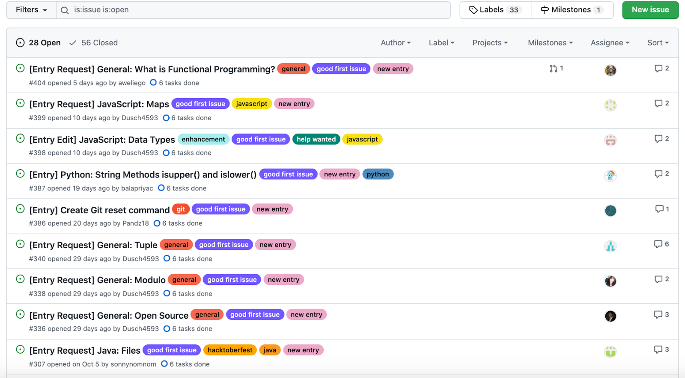
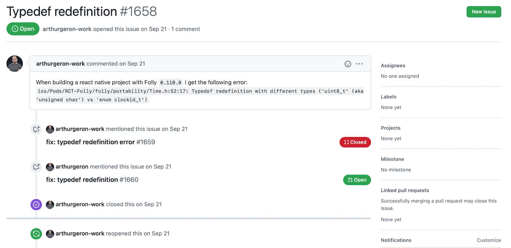
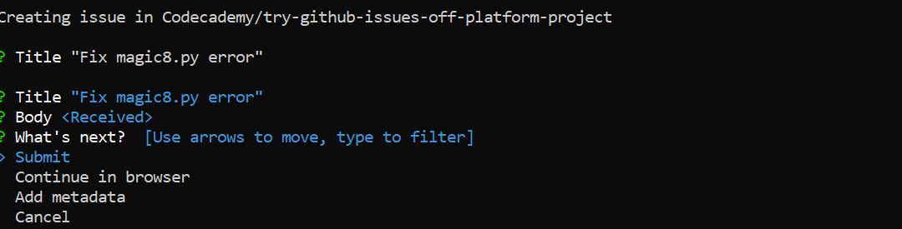
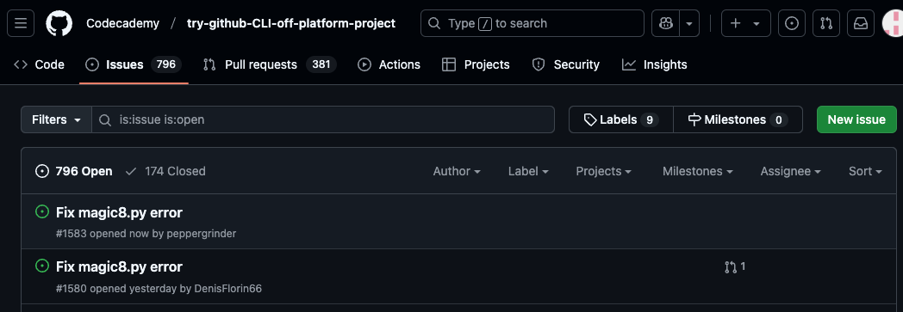
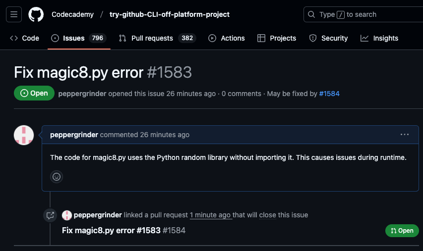
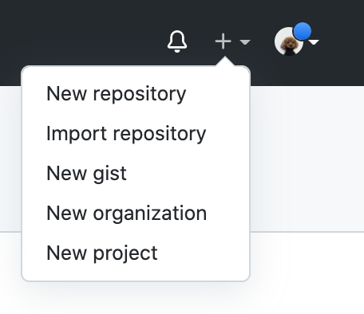
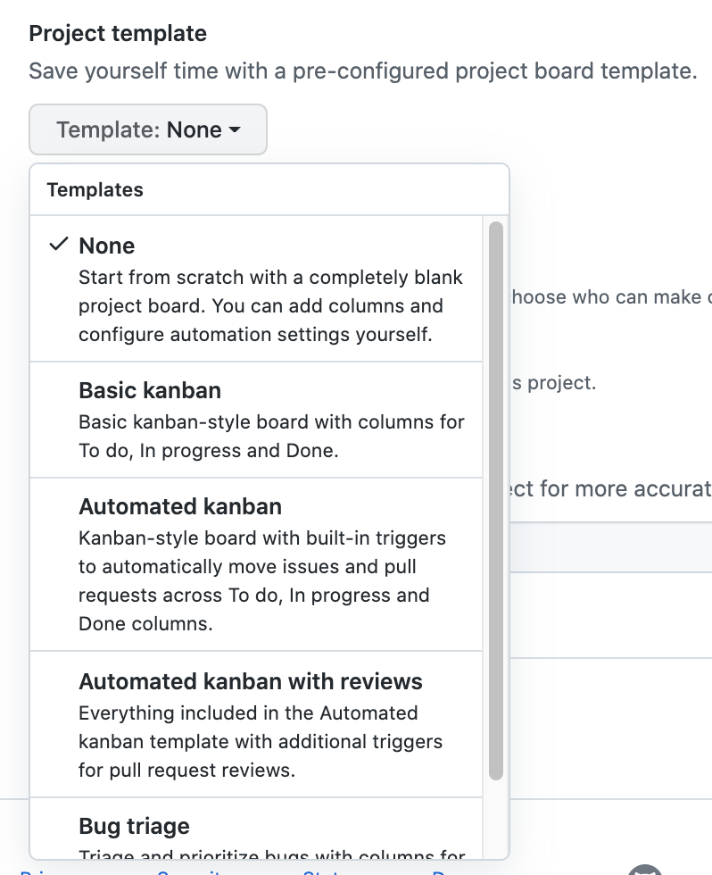
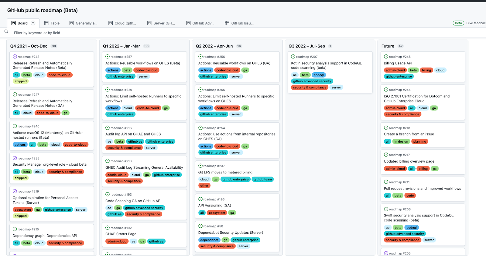

# git & GitHub - HowTo

[codecademy-course](https://www.codecademy.com/learn/learn-git/modules/learn-git-git-backtracking-u/cheatsheet)

[cheatsheet-edu](/resources/pdf/git-cheat-sheet-education.pdf)

[cheatsheet](https://www.codecademy.com/resources/docs/git/pull)

| Command                               | Description   |
|---------------------------------------|-------------|
| `git -h` | general help |
| `git help -a` | detailed help |
| `git branch -h` | help on branches |
| `git config --edit` | edit your config file |
| `git config -l --show-origin` | list of config options and their locations |
| `git config --edit --global` | edit your global config file |

## Generalizations

| Command                               | Description   |
|---------------------------------------|-------------|
| `git init` | creates a new Git repository. |
| `git add` | adds files from the working directory to the staging area. |
| `git add filename_1 filename_2` | add more files to stage. |
| `git add .` | add all files from WorkingDir to stage. |
| `git status` | inspects the contents of the working directory and staging area. |
| `git commit -m "commit msg"` | permanently stores file changes from the staging area in the repository. |
| `git log` | shows a list of all previous commits. |

## Contents

+ [Visual Studio Code integration](#git-integration-visual-studio-code-and-first-time-setup)
+ [Create a new git repository](#create-a-new-git-repository)
+ [Add existing code to empty GitHub repo](#add-existing-code-to-empty-github-repo)
+ [GitHub Flow](#github-flow)
+ [Create and merge pull requests](#github-steps-to-create-and-merge-pull-requests)
+ [Branches](#branches)
+ [HEAD commit](#head-commit)
+ [git diff, log](#git-diff-log)
+ [git reset](#git-reset-i-un-stage)
+ [git stash](#git-stash)
+ [Clone from remote](#clone-from-remote)
+ [Forking](#forking)
+ [git rebase](#rebase)
+ [gitignore](#gitignore)
+ [GitHub Features](#github-features)
  + [GitHub Issues](#github-issues)
  + [GitHub CLI](#github-cli-gh)
  + [GitHub Actions](#github-actions)
  + [GitHub Project Management](#github-project-management)
  + [Conclusion](#conclusion)

## Git integration Visual Studio Code and first-time setup

```zsh
git --version
git config  --global --list
git config --global user.name "UserName"
git config --global user.email  "your@email.com"
git config --global merge.tool vscode # needed for VSC to sync
git config --global mergetool.vscode.cmd 'code --wait $MERGED' # needed for VSC to sync
```

## Create a new git repository

```zsh
$ git init
Initialized empty Git repository in /home/user/new-project/.git/
$ echo "Hello World!" >> hello.txt
$ git add hello.txt 
$ git commit -m 'initial commit'
[main (root-commit) bb0e565] initial commit
 1 file changed, 1 insertion(+)
 create mode 100644 hello.txt
$ git branch
* main
```

## Add existing code to empty GitHub repo

| Command                               | Description   |
| ------------------------------------- | ------------- |
| `git remote add origin https://github.com/YOURREPO` | link to your empty repo on GitHub. |
| `git push -u origin main` | push changes to GitHub (`-u`, `--set-upstream` is optional). |
| From here you can: |  |
| `git pull origin main`    | Pull changes from origin |
| `git push`        | Since origin is set, we can simply push |

## GitHub Flow

1. Work on a specific branch
2. Commit changes and push code to remote repo
3. Create pull request
4. Discuss pull request with reviewers
5. Merge branch once pull request accepted (and delete branch)

## GitHub steps to create and merge pull requests

1. Submit pull request with description
2. Make changes from feedback
3. Merge code

## Branches

| Command                               | Description   |
| ------------------------------------- | ------------- |
| `git branch` | show all branches |
| `git branch new-branch`     | Create a new branch "new-branch" |
| `git checkout new-branch`   | switch to branch "new-branch" |
| --- | --- |
| `git checkout main`         | switch to branch "main" |
| `git merge new-branch`      | this will add the changes from "new-branch" into the current ("main") branch |
| `git branch -d new-branch`  | deleting branch "new-branch" - good practice to delete after merge into main |

## HEAD commit

| Command                       | Description   |
|-------------------------------|---------------|
| `git show HEAD`               | display everything the git log command displays for the HEAD commit, plus all the file changes that were committed. |
| `git checkout HEAD filename`  | restore the file in your working directory to look exactly as it did when you last made a commit. |
| `git checkout -- filename`    | shortcut - for above. |

## git diff, log

| Command                               | Description   |
|---------------------------------------|---------------|
| `git diff fileName` | check for differences between your file and the last commit. |
| `git log -S "keyword"` | filter log for "keyword" |
| `git log --oneline` | log as 'one liner' |
| `git log --oneline --graph` | log as 'one liner' with branches graph |
| `git log --graph --decorate --oneline --all` | log extra options |

## git reset I (un-stage)

| Command                               | Description   |
|---------------------------------------|---------------|
| `git reset HEAD filename` | resets the file in the staging area to be the same as the HEAD commit. It does not discard file changes from the working directory, it just removes them from the staging area. |

## git reset II (and force-push to GitHub after)

| Command                               | Description   |
|---------------------------------------|---------------|
| `git reset commit_SHA`                | This command works by using the first 7 characters of the SHA of a previous commit (git reset 5d69206). |
| `git reset 5d69206 --hard`            | hard reset might be needed.  |
| `git push -f origin main`             | force push your reset to GitHub (Your branch is behind 'origin/main' by 1 commit,...) |

## git stash

| Command                               | Description   |
|---------------------------------------|---------------|
| `git stash -h` |  |
| `git stash` | save working dir to shash (locally) |
| `git branch xyz_123` | create new branch "xyz_123" |
| `git checkout xyz_123` | switch to other branch "xyz_123" |
| --- | --- |
| `git checkout main` | switch to main branch again |
| `git stash list` | show your stashes |
| `git stash pop` | bring back stash |

## Clone from remote

| Command                               | Description   |
|---------------------------------------|---------------|
| `git clone remote_location clone_name` | get your replica / clone_name is the name you give to the directory in which Git will clone the repository. |
| `git remote -v` | list remotes. |
| `git fetch` | fetch changes from origin. |
| `git merge origin/main` | merge fetched changes from origin to your "main" branch. |
| `git add filename` | add edited file "filename" to the stage. |
| `git commit -m "commit msg"` | commit changes to your local copy. |
| `git commit --amend --no-edit` | allows for editing previous commit, instead of creating a new one, while keeping the same commit message (--no=edit). |
| `git push origin your_branch` | push changes to origin into branch `your_branch`. |

## [Forking](https://www.codecademy.com/courses/learn-git/articles/forking-a-repository-tutorial)

A fork is a duplicate of an existing repository. This "fork” is an independent entity that allows a contributor to interact with the original repository. Collaboration, experimentation, and contributions to open-source code are made possible by forking. It enables developers worldwide to collaborate, make changes, and contribute to projects while retaining the integrity of the source code. It is a secure approach to modify and test code without making changes directly to the original.

### Forking steps

1. In your browser, go to the repo you wish to fork.
2. Hit 'Fork' top right, and add a clone to your GitHub space.
3. Now you can download this repo to your computer like any other using `git clone`.
    + (Fork to directory `/forks` on your machine to keep things organised)
4. Set upstream in order to receive updates from parent
    + shell: cd into your clone
    + get parent's `https` key -> `git remote add upstream https://github.com/parentRepo.git`
5. Fetch upstream: `git fetch upstream'
    + Compare number of commits on parent with your clone.

| Command                               | Description   |
|---------------------------------------|---------------|
| `git clone https://github.com/...` | Clone your fork locally. |
| `git remote -v` | See that the original repo forked from does not exist yet. |
| `git remote add upstream https://github.com/...` | accepts updates from original repo. |
| `git fetch upstream` | fetches updates from original branches. |
| `git merge upstream/main main` | Merge changes from upstream branch 'main' to your local 'main' branch. |

To add your origin permanently you can add it to `git config --edit` under `[core]` in **`[checkout]`**:

```json
[core]
        repositoryformatversion = 0
        filemode = true
        bare = false
        logallrefupdates = true
        ignorecase = true
        precomposeunicode = true
[checkout]
        defaultRemote = origin
[remote "origin"]
        url = ...
```

## rebase

Git rebase is an important feature for collaborating effectively in a development team. Using git rebase, you can keep your branches up to date with the most recent changes while keeping your in-progress changes isolated!

| Command                               | Description   |
|---------------------------------------|---------------|
| `git rebase main` | rebase your current branch to main. |

## gitignore

[GitHub's gitignore repository](https://github.com/github/gitignore)

| Command                               | Description   |
|---------------------------------------|---------------|
| `find . -name .DS_Store -print0 \| xargs -0 git rm --ignore-unmatch` | find and remove all .DS_Store files including subfolders (`-f` at end might be required). |
| `git rm --cached .DS_Store` | manually remove .DS_Store files. |
| --- | --- |
| `echo .DS_Store >> .gitignore` | create a local `.gitignore`. (watch for correct directory) |
| `git config --global core.excludesfile .gitignore_global` | link a global `.gitignore_global`. (p.e. in GitHub directory on your pc / needs to exist prior) |
| `git config --global core.excludesfile` | shows the name of your global `.gitignore`. |
| --- | --- |
| `node_modules/` | ignore the node_modules directory, and all subdirectories and files inside. |
| `*.html` | ignore all `.html` files. |
| `example*` | ignore all any files starting with `example`. |
| `!` | Negation |
| Negation | --- |
| `index*` | will ignore all files starting with `index` except for `src/index.css`. |
| `!public/index.css` | but, we cannot negate a file inside an ignored directory. |
| Range | - [] - |
| `[a-z], [A-Z], [0-9]` | match a single character from a set of characters or a range of characters. |
| `**` | match 0 or more directories. |
| `**/temp/*.log` | match all `.log` files in all `temp` directories and sub-dirs in root-dir. |
| `v[1-3]/**/*.log` | match all `.log` files in `v1, v2, v3` directories and sub-dirs. |

## GitHub Features

### GitHub Issues

GitHub Issues adds project management right to your repository. You can list tasks and organize them into which are open and in progress. These issues can also be referenced in pull requests and even other issues.


The issue board acts as a forum for all the collaborators of the repository. In some instances, issue boards are public and users of a project can submit and discuss bugs they've encountered.

#### Labels

To help organize issues when more and more pop up in a project, we can use labels. bug and feature are common labels used to differentiate between errors and new features. In the Codecademy Docs repo Issue board earlier, we could see labels such as Good first issue, if a suggested entry to Docs is new or an edit, and what language the entry should be in, like C# or Java. Labels help us toggle between different types of issues at a glance and have short names.

#### Creating an Issue

To create an Issue, we can click the New Issue button on top of the Issues board. This will take us to a new page where to set the title and content of the issue.

Issues are a bit like pull requests in that we want to keep the title specific but to the point. For descriptions, repositories often have their own guidelines (just like pull requests do) for including details. For example, if the issue is related to a bug, we should include the error message in the description. Check out a complete issue from the Facebook Folly repository:

Once the issue is posted and now open, collaborators and other GitHub users can add to the discussion and reference this issue by the # in other issues and pull requests.

### GitHub CLI (gh)

The GitHub Command Line Interface (CLI) is a tool that allows you to directly access and. modify issues and pull requests right from your terminal!

`brew install gh`

#### [Installation](https://github.com/cli/cli#installation)

Download and execute the installer for your operating system from the GitHub CLI public webpage. Once the installation is complete, open a new terminal and verify the default configuration:
`gh --version`

Review the list of the supported APIs and functionalities:

| Command                               | Description   |
|---------------------------------------|---------------|
| `gh --help`      | General help     |
| `gh auth --help` | Learn about auth |
| `gh auth status` | Check auth status |
| `gh auth login` | Login to GitHub from your terminal |

#### GitHub CLI in action

[Fork the try-GitHub-cli-off-platform-project](https://github.com/Codecademy/try-github-CLI-off-platform-project) repository to your GitHub account and clone it onto your local computer. Next, open a terminal and change the current directory to the directory of the cloned repository.

The repository contains a simple Python application for a Magic Eight Ball. The application, however, has a defect. The code tries to use the Python random library without importing it.

Login to GitHub from your terminal using GitHub CLI and follow the instructions to complete the authentication.
`> gh auth login`

```zsh
taaroth4@TRoMBProM2Pro Off-platform-proj % gh auth login
? Where do you use GitHub? GitHub.com
? What is your preferred protocol for Git operations on this host? HTTPS
? Authenticate Git with your GitHub credentials? Yes
? How would you like to authenticate GitHub CLI? Login with a web browser

! First copy your one-time code: B41C-26C4
Press Enter to open https://github.com/login/device in your browser...
✓ Authentication complete.
- gh config set -h github.com git_protocol https
✓ Configured git protocol
✓ Logged in as peppergrinder
```

View issues: `gh issue status`

If running into this: `X No default remote repository has been set for this directory.`

run this: `gh repo set-default`

```zsh
% gh repo set-default
This command sets the default remote repository to use when querying the
GitHub API for the locally cloned repository.

gh uses the default repository for things like:

 - viewing and creating pull requests
 - viewing and creating issues
 - viewing and creating releases
 - working with GitHub Actions
 - adding repository and environment secrets

? Which repository should be the default? Codecademy/try-github-CLI-off-platform-project
✓ Set Codecademy/try-github-CLI-off-platform-project as the default repository for the current directory
```

Check on issues again

```zsh
% gh issue status

Relevant issues in Codecademy/try-github-CLI-off-platform-project

Issues assigned to you
  There are no issues assigned to you

Issues mentioning you
  There are no issues mentioning you

Issues opened by you
  There are no issues opened by you
```

Use the command line to create a GitHub Issue documenting the problem:

```zsh
> gh issue create --title "Fix magic8.py error" --body "The code for magic8.py uses the Python random library without importing it. This causes issues during runtime."
```

Follow the instructions in the terminal and select the forked repository to create the issue.

Once the issue is created, you can view it on GitHub web interface under the Issues tab.

You can also use GitHub CLI to list all opened issues so far:

```zsh
Off-platform-proj % gh issue status

Relevant issues in Codecademy/try-github-CLI-off-platform-project

Issues assigned to you
  There are no issues assigned to you

Issues mentioning you
  There are no issues mentioning you

Issues opened by you
ID       TITLE                LABELS  UPDATED            
  #1583  Fix magic8.py error          about 4 minutes ago
```

Let's now create a new branch to actually fix the issue.

```zsh
% git checkout -b "fix-magic8" 
Switched to a new branch 'fix-magic8'
```

Open the magic8.py file using an editor of your choice and add the following line at the beginning of the file to fix the defect:

```Python
import random
```

Commit and push your change to the remote.

```shell
git commit -a -m "Fixed magic8.py file by importing the proper required library"
git push --set-upstream origin fix-magic8
```

Now that there's a full solution to the problem in your branch, it's time to create a pull request! You can use the command line to directly make a pull request:

`gh pr create`

Follow the prompts and add the proper title and description for the pull request. Mention the id of the issue in the description following #[id] format so that GitHub automatically links the pull request to the issue.
To check if this actually worked, you can check that the new pull request appears under the Pull Requests tab. Also, observe the state of the issue and see that the issue is now linked to the pull request.


Assuming that your pull request is good to go, you can merge your pull request using the following GitHub CLI command:

```zsh
gh pr merge
Merging pull request Codecademy/try-github-CLI-off-platform-project#1584 (Fix magic8.py error #1583)
? What merge method would you like to use?  [Use arrows to move, type to filter]
> Create a merge commit
  Rebase and merge
  Squash and merge
```

> Error: GraphQL: peppergrinder does not have the correct permissions to execute `MergePullRequest` (mergePullRequest)
> Check the next excercise, where you fork a repo and update your GitHub fork version. Here merging is not a problem.

Once the pull request is merged, check back the status of the issues and notice that the issue is now closed and no longer listed under the open issues:
`gh issue status`

### GitHub Actions

Want to add automated tests after a pull request is created? Want to trigger something after a branch is merged into main? We can use GitHub Actions!

GitHub Actions is a powerful, advanced GitHub feature that enables users to define custom and automated workflows triggered on various types of events such as pushing code or creating a pull request. The workflows execute inside a temporary container running in GitHub infrastructure.

### GitHub Project Management

GitHub projects is a beta feature (as of late 2021) for project management. While other project management tools exist, like JIRA or even handwritten post-its, GitHub projects allow direct integration within the repository, letting developers stay within the same ecosystem. We can also create automated project boards that trigger the status of issues and pull requests. And… it's completely free!

To try out projects, we can select the New Project option after clicking the + button on the upper right side of the GitHub dashboard. In most cases, projects are linked to repositories, which already have existing issues and pull requests, but in other cases, projects can be standalone.

After filling out the name and description of the new project, a drop-down will appear asking what Project template we want to use.

The options range from different types of Kanban boards that can host issues and pull requests to a Bug Triage, which gives details into which bugs are high priority, low priority, or need further investigation. Once the board is created, we will [add issues and pull requests](https://docs.github.com/en/issues/organizing-your-work-with-project-boards/tracking-work-with-project-boards/adding-issues-and-pull-requests-to-a-project-board) to it.

An example of a laid-out GitHub project board is [Github's own public roadmap project](https://github.com/orgs/github/projects/4247/views/1), shown next. This is an example of a Project with no repository, as a roadmap can be used for organizational purposes.


### Conclusion

We learned about two GitHub features that can come in handy for teams: issues and projects. We can use GitHub issues to keep track of tasks that need to be worked on. Those issues can then be referenced in pull requests, comments, or projects. GitHub projects are an even newer feature for project management purposes and can be linked to repositories. We can choose from a variety of different board types to organize tasks.
